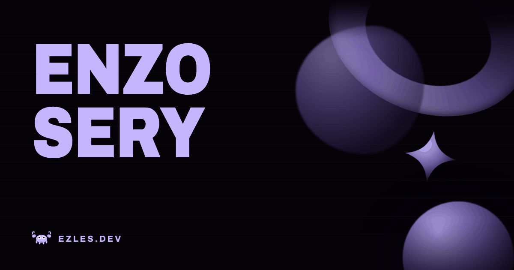

  

[**Portfolio**](https://ezles.dev) &nbsp;·&nbsp; [**Email**](mailto:contact@ezles.dev) &nbsp;·&nbsp; [**LinkedIn**](https://www.linkedin.com/in/enzo-sery-9ba4951a5/)

 

<table>
<tr>
<td valign="top" width="62%">

### About

React and Next.js day to day, that's what my apprenticeship runs on. Learning Rust seriously on the side: Axum backends, SeaORM, Leptos and Dioxus frontends.

Grew up in Réunion, left the island to study on the continent. Comfort zones are meant to be
crossed, and that mindset follows me into every project.

 

### Contact

Open to new projects. Tell me what you're working on.

**Email** &nbsp; [contact@ezles.dev](mailto:contact@ezles.dev) &nbsp;&nbsp; **LinkedIn** &nbsp; [Enzo Sery](https://www.linkedin.com/in/enzo-sery-9ba4951a5/)

</td>
<td valign="top" width="38%" align="center">

### Stack

</td>
</tr>
</table>

 

© ezles

